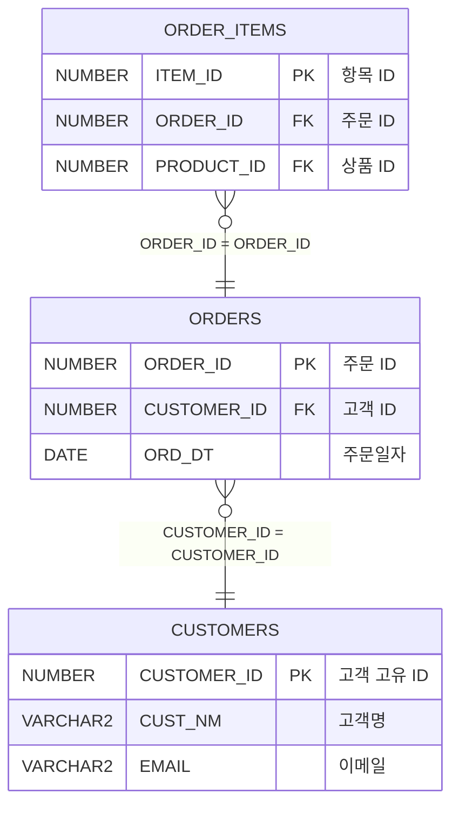

# Oracle Schema & Query Analyzer

Oracle DB 스키마 + MyBatis 쿼리를 분석하여 Markdown 추출, 벡터 DB 임베딩, RAG 기반 ERD 자동 생성까지 지원하는 도구입니다.

FK/description이 없는 레거시 DB 환경에서 **쿼리 JOIN 분석 + 로컬 LLM**으로 테이블 관계를 추론합니다.

## 전체 파이프라인

```
┌─────────────────────────────────────────────────────────┐
│ Step 1. 데이터 추출                                      │
│   python main.py schema       → 스키마 .md 생성          │
│   python main.py query ./xml  → 쿼리분석 .md 생성        │
├─────────────────────────────────────────────────────────┤
│ Step 2. 벡터 DB 생성 (로컬 임베딩 모델)                    │
│   python main.py embed --schema-md --query-md            │
│   → ChromaDB에 임베딩 저장                                │
├─────────────────────────────────────────────────────────┤
│ Step 3. RAG 기반 ERD 생성 (로컬 LLM)                     │
│   python main.py erd-rag                                 │
│   → 벡터 검색 → LLM이 Mermaid ERD 코드 생성              │
└─────────────────────────────────────────────────────────┘
```

## 기능 요약

| Command | 설명 | Oracle 접속 | 임베딩 모델 | LLM |
|---------|------|:-----------:|:----------:|:---:|
| `schema` | 테이블/컬럼 스키마 .md 추출 | O | X | X |
| `query` | MyBatis XML 쿼리 분석 .md | X | X | X |
| `embed` | .md를 벡터 DB에 임베딩 | X | O | X |
| `erd-rag` | RAG로 Mermaid ERD 생성 | X | O | O |
| `erd` | 직접 DB 접속 ERD 생성 | O | X | 선택 |
| `all` | schema + query + erd | O | X | 선택 |

## 프로젝트 구조

```
convert/
├── main.py                    # CLI (schema/query/embed/erd-rag/erd/all)
├── config.yaml                # 설정 파일
├── .env.example               # 환경변수 템플릿
├── requirements.txt
└── oracle_embeddings/
    ├── db.py                  # Oracle DB 연결 (thick mode, 11g 호환)
    ├── extractor.py           # 스키마 메타데이터 추출
    ├── mybatis_parser.py      # MyBatis XML 파싱 & JOIN 분석
    ├── vector_store.py        # ChromaDB 벡터 저장소 & 임베딩
    ├── rag_erd.py             # RAG 기반 ERD 생성 (벡터 검색 + LLM)
    ├── erd_generator.py       # 구조화 데이터 기반 ERD 생성
    ├── llm_assist.py          # LLM 보조 (컬럼 해석, 관계 추론)
    └── storage.py             # Markdown 파일 생성
```

## 설치

```bash
pip install -r requirements.txt
```

## 설정

```bash
cp .env.example .env
```

```env
ORACLE_USER=myuser
ORACLE_PASSWORD=changeme
# LLM_API_KEY=your-key  # Ollama는 불필요
```

### config.yaml

```yaml
oracle:
  dsn: "your_host:1521/your_service"
  user: "${ORACLE_USER}"
  schema_owner: "${ORACLE_USER}"
  instant_client_dir: "C:/oracle/instantclient_19_25"

storage:
  file_format: "markdown"
  output_dir: "./output"

vectordb:
  db_path: "./vectordb"

# 로컬 임베딩 모델
embedding:
  api_base: "http://localhost:11434/v1"
  api_key: "ollama"
  model: "nomic-embed-text"    # 또는 bge-m3, mxbai-embed-large

# 로컬 생성 모델
llm:
  api_base: "http://localhost:11434/v1"
  api_key: "ollama"
  model: "llama3"              # 또는 qwen2.5, mistral
```

## 사용법

### Step 1. 데이터 추출

```bash
# 스키마 추출 (Oracle 접속 필요)
python main.py schema

# 쿼리 분석 (Oracle 접속 불필요)
python main.py query /path/to/mybatis/mapper
```

### Step 2. 벡터 DB에 임베딩

```bash
# 스키마 + 쿼리 둘 다 임베딩
python main.py embed \
  --schema-md ./output/HR_schema_20260402.md \
  --query-md ./output/query_analysis_20260402.md

# 스키마만
python main.py embed --schema-md ./output/HR_schema_20260402.md

# 쿼리만
python main.py embed --query-md ./output/query_analysis_20260402.md
```

### Step 3. RAG 기반 ERD 생성

```bash
# 전체 테이블 ERD
python main.py erd-rag

# 특정 테이블만 (관련 테이블 자동 포함)
python main.py erd-rag --tables "ORDERS,CUSTOMERS,ORDER_ITEMS"
```

### 한번에 실행 예시

```bash
# 1) 스키마 추출
python main.py schema

# 2) 쿼리 분석
python main.py query ./src/main/resources/mapper

# 3) 임베딩
python main.py embed \
  --schema-md ./output/HR_schema_20260406.md \
  --query-md ./output/query_analysis_20260406.md

# 4) ERD 생성
python main.py erd-rag --tables "ORDERS,CUSTOMERS"
```

## 출력 예시

### `output/erd_rag_ORDERS_CUSTOMERS_20260406_120000.md`

````markdown
# ERD (RAG-Generated)

로컬 임베딩 모델 + 벡터 DB(ChromaDB) + 로컬 LLM을 활용한 RAG 기반 ERD입니다.

## Mermaid ERD


````

### 렌더링 방법

- **VS Code**: Mermaid Preview 확장 설치 → `.md` 파일 미리보기
- **mermaid-cli**: `npm install -g @mermaid-js/mermaid-cli` → `mmdc -i erd.md -o erd.png`

## Msty RAG 활용

Step 1에서 생성한 `.md` 파일들을 Msty Knowledge Base에도 임포트하면 자연어 질의가 가능합니다:

- "ORDERS 테이블과 연관된 테이블은?"
- "CUSTOMER_ID를 사용하는 모든 테이블 보여줘"
- "주문 도메인 ERD를 Mermaid로 그려줘"

## 라이선스

MIT
