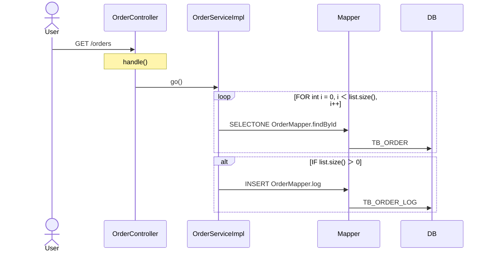

# Oracle Schema & Query Analyzer

Oracle DB 스키마 + MyBatis 쿼리를 분석하여 Markdown 추출, ERD 자동 생성, 표준화 리포트까지 지원하는 도구입니다.

FK/description이 없는 레거시 DB 환경에서 **쿼리 JOIN 분석 + 로컬 LLM**으로 테이블 관계를 추론합니다.

## 기능 요약

| Command | 설명 | Oracle 접속 | LLM |
|---------|------|:-----------:|:---:|
| `schema` | 테이블/컬럼 스키마 .md 추출 | O | X |
| `query` | MyBatis XML 쿼리 분석 .md | X | X |
| `enrich-schema` | 빈 코멘트를 LLM이 추천하여 보강 | X | O |
| `erd-md` | .md 파일에서 Mermaid ERD 생성 | X | X |
| `erd-group` | 관계 기반 주제영역별 ERD 분할 생성 | X | X |
| `terms` | 용어사전 자동 생성 (스키마 + React) | X | O |
| `morpheme` | 형태소분석 — 속성명 txt → LLM 단어 분해 리포트 (속성명/컨피던스/단어1..12/비고 단일 시트 xlsx + md 요약) | X | O |
| `gen-ddl` | 자연어 → 표준 DDL 생성 (+ 검증) | 선택 | O |
| `audit-standards` | 전체 스키마 표준 위반 일괄 검사 | X | X |
| `validate-naming` | 테이블/컬럼명 네이밍 표준 검증 | X | X |
| `review-sql` | SQL 쿼리 정적 분석 + LLM 리뷰 | X | 선택 |
| `standardize` | 표준화 분석 리포트 생성 | 선택 | O |
| `analyze-legacy` | AS-IS 레거시 소스 통합 분석 (Spring/Vert.x/Nexcore + MyBatis/iBatis + React/Polymer + Menu) + **ServiceImpl 비즈니스 로직 LLM 추출** (opt-in `--extract-biz-logic`) | 선택 | 선택 |
| `discover-patterns` | LLM 으로 프로젝트 패턴 자동 발견 (analyze-legacy 사전 단계) | X | O |
| `convert-menu` | 임의 양식의 메뉴 Excel → 표준 menu.md 변환 (LLM 이 헤더 매핑 학습) | X | O |
| `convert-mapping` | AS-IS↔TO-BE 컬럼 매핑 .md → `column_mapping.yaml` (LLM + heuristic 이 kind/transform 추론; **사용자 표준 9-컬럼 flat 포맷 지원** — asis/tobe table/column/type/comment/remark) | 선택 | X |
| `migration-impact` | SQL Migration 사전 영향분석 (매핑 YAML 검증 + AS-IS 쿼리 영향 리포트) | X | X |
| `migrate-sql` | AS-IS MyBatis XML → TO-BE 스키마용 쿼리 일괄 변환 + Excel/XML 산출물 (`--format-only` 로 매핑 없이 포매터만 미리보기 가능) | X | 선택 |
| `validate-migration` | 변환된 XML 의 TO-BE SQL 을 TO-BE DB 에 parse-only 검증 (Stage B) | O | X |
| `embed` | .md를 벡터 DB에 임베딩 | X | X |
| `erd-rag` | RAG로 Mermaid ERD 생성 | X | O |
| `erd` | 직접 DB 접속 ERD 생성 | O | 선택 |

## 프로젝트 구조

```
convert/
├── main.py                       # CLI 진입점
├── config.yaml                   # 설정 파일
├── .env.example                  # 환경변수 템플릿
├── requirements.txt
└── oracle_embeddings/
    ├── db.py                     # Oracle DB 연결 (thick mode, 11g 호환)
    ├── extractor.py              # 스키마 메타데이터 추출
    ├── mybatis_parser.py         # MyBatis XML 파싱 & JOIN 분석
    ├── md_parser.py              # .md 파일 → 구조화 데이터 파싱
    ├── schema_enricher.py        # LLM 코멘트 보강
    ├── erd_generator.py          # 구조화 데이터 → Mermaid ERD
    ├── graph_cluster.py          # JOIN 기반 테이블 그룹 클러스터링
    ├── std_analyzer.py           # 표준화 구조 분석
    ├── std_data_validator.py     # 실데이터 검증 (Oracle)
    ├── std_report.py             # 표준화 리포트 + LLM 제안
    ├── vector_store.py           # ChromaDB 벡터 저장소
    ├── rag_erd.py                # RAG 기반 ERD 생성
    ├── llm_assist.py             # LLM 보조 (컬럼 해석, 관계 추론)
    ├── storage.py                # Markdown 파일 생성
    ├── legacy_java_parser.py     # 레거시 Java 정규식 파서 (Controller/Service/Mapper/RFC)
    ├── legacy_frontend.py        # 프론트엔드 React/Polymer 자동 감지 + 디스패처
    ├── legacy_pattern_discovery.py # LLM 기반 프로젝트 패턴 자동 발견
    ├── legacy_react_router.py    # React Router v5/v6 + lazy import 스캐너
    ├── legacy_polymer_router.py  # Polymer (vaadin-router/page.js/dom-module) 파서
    ├── legacy_menu_loader.py     # 메뉴 로더 (DB 테이블 / Excel / Markdown)
    ├── legacy_analyzer.py        # AS-IS 통합 오케스트레이터 (양방향 URL 매칭)
    ├── legacy_report.py          # AS-IS 리포트 Markdown + Excel (최대 8시트)
    ├── legacy_biz_extractor.py   # Phase A: ServiceImpl 비즈니스 로직 LLM 추출 (opt-in)
    ├── legacy_util.py            # URL 정규화 공유 헬퍼
    └── migration/
        ├── mapping_model.py         # 매핑 dataclass
        ├── mapping_loader.py        # YAML 로드 + 검증
        ├── mapping_converter.py     # md/txt → YAML (9-컬럼 flat 지원)
        ├── sql_rewriter.py          # SQL 재작성 오케스트레이터
        ├── sql_formatter.py         # Korean Legacy 포매터 (리딩-콤마 등)
        ├── comment_injector.py      # /* 한글 */ 자동 삽입
        ├── xml_rewriter.py          # MyBatis XML 변환
        ├── validator_static.py      # Stage A — sqlglot 검증
        ├── validator_db.py          # Stage B — Oracle parse 검증
        ├── dynamic_sql_expander.py  # MyBatis <if>/<choose>/<foreach> 전개
        ├── llm_fallback.py          # NEEDS_LLM 상태 통과 시 LLM 변환
        ├── migration_report.py      # 5시트 Excel 리포트
        ├── impact_analyzer.py       # 사전 영향분석
        ├── bind_dummifier.py        # Stage B 전처리 (#{}/${} 제거)
        └── transformers/            # 8종 변환기 (TableRename/ColumnRename/...)
```

## 설치

```powershell
python -m pip install -r requirements.txt
```

## 설정

```powershell
cp .env.example .env
```

`.env` 파일 수정:
```env
# Oracle DB
ORACLE_USER=myuser
ORACLE_PASSWORD=changeme
ORACLE_DSN=localhost:1521/ORCL
ORACLE_SCHEMA_OWNER=myuser
ORACLE_INSTANT_CLIENT_DIR=C:/oracle/instantclient_19_25

# LLM / 임베딩 (Ollama, vLLM 등)
LLM_API_BASE=http://localhost:11434/v1
LLM_API_KEY=ollama
LLM_MODEL=qwen2.5
EMBEDDING_API_BASE=http://localhost:11434/v1
EMBEDDING_API_KEY=ollama
EMBEDDING_MODEL=Qwen3-Embedding-8B
```

## 사용법

### 1. 스키마 추출 (Oracle 접속 필요)

```powershell
python main.py schema
python main.py schema --owner HR
python main.py schema --table CUSTOMERS
```

### 2. 쿼리 분석 (Oracle 접속 불필요)

MyBatis, iBatis XML 모두 지원합니다.

```powershell
# 기본 실행
python main.py query /path/to/mybatis/mapper

# 스키마 .md 기반 필터링 (스키마에 없는 테이블 제외, 권장)
python main.py query /path/to/mybatis/mapper --schema-md ./output/스키마.md
```

### 3. 스키마 코멘트 보강 (LLM)

빈 테이블/컬럼 코멘트를 LLM이 약어를 해석하여 자동 추천합니다.
확신할 수 없는 약어는 비워둡니다.

```powershell
python main.py enrich-schema --schema-md ./output/스키마.md
```

출력: `output/스키마_enriched_TIMESTAMP.md` (보강된 스키마)

### 4. ERD 생성

```powershell
# .md 파일에서 직접 ERD (LLM 불필요, 즉시 실행)
python main.py erd-md --schema-md ./output/스키마.md --query-md ./output/query.md --related-only

# 특정 테이블 + 관련 테이블만
python main.py erd-md --schema-md ./output/스키마.md --query-md ./output/query.md --tables "ORDERS,CUSTOMERS"

# 주제영역별 그룹 분할 ERD
python main.py erd-group --schema-md ./output/스키마.md --query-md ./output/query.md
python main.py erd-group --schema-md ./output/스키마.md --query-md ./output/query.md --max-size 15
```

### 5. 용어사전 자동 생성

스키마 컬럼명 + React 소스 변수명에서 단어를 수집하고, LLM이 약어/영문명/한글명/한글 정의를 생성합니다.

```powershell
# 스키마 + React 소스 양쪽에서 수집
python main.py terms --schema-md ./output/스키마.md --react-dir /path/to/react/src

# 스키마만
python main.py terms --schema-md ./output/스키마.md

# LLM 없이 단어 수집만
python main.py terms --schema-md ./output/스키마.md --react-dir ./src --skip-llm
```

LLM이 생성하는 필드:
- **Abbreviation** — 표준 DB 약어 (2~5자)
- **English Full** — 영문 Full Name
- **Korean** — 한글명
- **Definition** — 한글 정의 (업무 의미 1~2문장, 50자 내외)

산출물:
```
output/
├── terms_dictionary_TIMESTAMP.md    # 용어사전 Markdown
└── terms_dictionary_TIMESTAMP.xlsx  # 용어사전 Excel
    ├── Sheet: 용어사전      (전체, Definition 포함)
    ├── Sheet: DB+FE공통     (양쪽에서 사용, 표준화 우선)
    ├── Sheet: DB전용        (DB에서만 사용)
    ├── Sheet: FE전용        (프론트에서만 사용)
    └── Sheet: 미식별        (LLM이 해석 못한 단어)
```

### 6. DDL 자동 생성 (자연어)

자연어 요청으로 표준을 준수하는 CREATE TABLE DDL을 자동 생성합니다.

```powershell
# 기본 사용 (용어사전 없이)
python main.py gen-ddl --request "고객 주문 이력 테이블"

# 용어사전 + 스키마 참조 (권장)
python main.py gen-ddl `
  --request "고객 주문 이력 테이블 만들어줘. 고객ID, 주문일자, 금액 포함" `
  --terms-md ./output/terms_dictionary.md `
  --schema-md ./output/스키마.md

# 생성 + 검증 + Oracle 실행 (컨펌 후)
python main.py gen-ddl `
  --request "배송 정보 테이블" `
  --terms-md ./output/terms_dictionary.md `
  --execute
```

**처리 흐름:**
1. 자연어 요청 + 용어사전 + 기존 스키마 샘플을 LLM에 전달
2. LLM이 표준 약어로 DDL 생성
3. 생성된 DDL을 자동으로 네이밍 표준 검증
4. 검증 결과 출력 + DDL 파일 저장
5. `--execute` 옵션 시 사용자 컨펌 후 Oracle 실행

### 7. 표준 위반 자동 감지 (audit-standards)

기존 스키마 전체를 대상으로 네이밍 표준 위반을 일괄 검사합니다.

```powershell
# 기본 약어 사전으로 검사
python main.py audit-standards --schema-md ./output/스키마.md

# 용어사전 기반 검사 (권장)
python main.py audit-standards `
  --schema-md ./output/스키마.md `
  --terms-md ./output/terms_dictionary.md
```

**산출물:**
```
output/
├── audit_standards_TIMESTAMP.md    # Markdown 리포트
└── audit_standards_TIMESTAMP.xlsx  # Excel (4개 시트)
    ├── Sheet: Summary          (전체 집계)
    ├── Sheet: Invalid Tables   (위반 테이블)
    ├── Sheet: Invalid Columns  (위반 컬럼)
    └── Sheet: Pattern Summary  (룰별 위반 빈도)
```

각 위반 항목에 심각도와 유사 약어 추천이 포함되어 마이그레이션/정비 작업 기초자료로 활용할 수 있습니다.

### 8. 네이밍룰 검증

용어사전 기반으로 테이블/컬럼명이 표준을 따르는지 검증합니다.

```powershell
# 단일 이름 검증
python main.py validate-naming --name "TB_CUSTOMER_ORDER" --terms-md ./output/terms_dictionary.md
python main.py validate-naming --name "CUST_NO" --kind column

# 파일의 이름 목록 일괄 검증
python main.py validate-naming --file new_tables.txt --terms-md ./output/terms_dictionary.md

# DDL 파일 파싱 후 검증
python main.py validate-naming --ddl create_tables.sql --terms-md ./output/terms_dictionary.md
```

**검증 항목:**

| 심각도 | 항목 | 설명 |
|--------|------|------|
| CRITICAL | LENGTH | 30자 초과 (Oracle 11g) |
| CRITICAL | SPECIAL_CHAR | 특수문자 사용 |
| CRITICAL | FIRST_CHAR | 첫 글자 숫자 |
| HIGH | CASE | 소문자 사용 (대문자+언더스코어 권장) |
| MEDIUM | UNKNOWN_ABBREVIATION | 용어사전에 없는 약어 (유사 약어 추천) |
| LOW | PREFIX | 테이블 접두어 (TB, TBL 등) 미사용 |

### 9. SQL 리뷰 (정적 분석 + LLM)

MyBatis/iBatis XML의 SQL 쿼리를 분석하여 비효율 패턴을 자동 감지합니다.

```powershell
# 정적 분석만
python main.py review-sql --mybatis-dir /path/to/mapper

# LLM 리뷰 포함 (상위 20개 이슈)
python main.py review-sql --mybatis-dir /path/to/mapper --llm-review

# LLM 리뷰 샘플 수 조절
python main.py review-sql --mybatis-dir /path/to/mapper --llm-review --max-samples 50
```

**감지 패턴:**

| 심각도 | 패턴 | 설명 |
|--------|------|------|
| CRITICAL | 카티시안 곱 | FROM 절 콤마 나열, JOIN 조건 없음 |
| CRITICAL | UPDATE/DELETE WHERE 없음 | 전체 테이블 영향 |
| HIGH | NOT IN | NULL 처리 및 성능 문제 |
| HIGH | LIKE '%...' | 선두 와일드카드 → 풀스캔 |
| MEDIUM | SELECT * | 불필요한 컬럼 조회 |
| MEDIUM | WHERE 컬럼 함수 | 인덱스 미사용 |
| MEDIUM | 스칼라 서브쿼리 | SELECT 절 서브쿼리 |
| MEDIUM | 암시적 형변환 | 타입 불일치 비교 |
| LOW | DISTINCT | 정렬 비용 |
| LOW | WHERE OR | 인덱스 방해 |

**산출물:**
```
output/
├── sql_review_TIMESTAMP.md    # 패턴별 + LLM 리뷰
└── sql_review_TIMESTAMP.xlsx  # Excel
    ├── Sheet: Summary       (심각도 집계)
    ├── Sheet: Issues        (전체 이슈 목록)
    ├── Sheet: Pattern Summary (패턴별 집계)
    └── Sheet: LLM Review    (LLM 개선안, --llm-review 시)
```

### 10. 표준화 분석 리포트

```powershell
# 구조 분석만 (Oracle 불필요, LLM으로 표준안 제안)
python main.py standardize --schema-md ./output/스키마.md --query-md ./output/query.md

# 구조 분석 + 실데이터 검증 (Oracle 접속)
python main.py standardize --schema-md ./output/스키마.md --query-md ./output/query.md --validate-data

# 실데이터 검증하되 컬럼 사용률 체크 스킵 (빠르게)
python main.py standardize --schema-md ./output/스키마.md --query-md ./output/query.md --validate-data --skip-usage
```

표준화 리포트 산출물:

```
output/std_report_TIMESTAMP/
├── 00_summary.md                  # 전체 요약
├── 01_join_column_mismatch.md     # JOIN 컬럼명 불일치 (동일 관계, 다른 이름)
├── 02_type_inconsistency.md       # 동일 컬럼 타입 불일치
├── 03_naming_pattern.md           # 네이밍 패턴 이탈
├── 04_identifier_pattern.md       # PK 접미어 패턴 분석
├── 05_code_columns.md             # 코드 컬럼 + DISTINCT 값
├── 06_yn_columns.md               # Y/N 컬럼 + 이상 데이터
├── 07_column_usage.md             # 미사용/과다할당 컬럼
└── 08_llm_proposals.md            # LLM 표준화 제안
```

### 11. AS-IS 레거시 소스 분석 (analyze-legacy)

Java/Spring/Vert.x/**Nexcore** + MyBatis/**iBatis** + React/**Polymer** + 메뉴 (DB/Excel/Markdown)를 **통합 분석**하여
차세대 전환 전 **프로그램 단위 메타데이터**를 일괄 추출합니다.
한 행 = 한 Controller 엔드포인트이며 메뉴 계층 → Controller → Service
→ DAO → Mapper XML → 관련 테이블 → RFC 호출까지 한 번에 매핑됩니다.

경로는 **백엔드/프론트엔드 루트 한 개씩만** 지정하면 됩니다. 백엔드 루트
하위를 재귀 탐색해서 `.java` 와 MyBatis/iBatis `*.xml` 을 모두 찾아내며,
`.git` / `.gradle` / `.idea` / `.svn` / `.hg` / `.next` / `node_modules`
폴더는 자동으로 제외됩니다 (`target` / `build` / `bin` 등 빌드 산출물
이름은 제외하지 않음 — 실제 프로젝트 폴더일 수 있어 `_is_sql_mapper` 가 별도로 필터링).

> **Windows 사용자 안내 (PowerShell 기본)**
>
> 아래 예시는 **PowerShell 그대로 복붙 가능**하도록 백틱 `` ` `` 줄바꿈과
> Windows 경로(`C:\...`)로 작성돼 있습니다. 본인 환경 경로로만 바꾸세요.
> - 여러 줄이 불편하면 모두 **한 줄로 붙여도** 동일하게 동작합니다.
> - **cmd.exe** 를 쓴다면 백틱 `` ` `` 대신 `^` 로 바꾸세요.
> - `python` 이 PATH 에 없으면 `py -m` 또는 `py main.py ...` 로 대체.
> - em-dash(`—`)는 단항 연산자로 오해됩니다 — 반드시 일반 하이픈만 사용.
> - Excel 에 DRM 이 걸려 열리지 않을 땐 `--menu-xlsx` 대신 `--menu-md input\menu_template.md` 사용.
>
> **⚠ 폐쇄망 사용자 주의 — 단방향 전송**:
> 이 도구를 쓰는 기업 내 Windows PC 는 대개 **외부 → 내부 다운로드는
> 가능하지만 내부 → 외부 업로드 / 복사·붙여넣기 는 차단** 돼 있습니다
> (코드/데이터 유출 방지). Claude Code 세션에 명령 결과를 전달하려면
> 사용자가 **수기로 타이핑** 해야 하므로:
> - 진단 / 디버깅 시 긴 로그 전체 붙여달라는 요청 대신, 도구 쪽에서
>   **결론 한 줄** (✓/⚠/✗ + 다음 액션) 을 먼저 찍고 상세는 옵트인.
> - 질문은 **선택지 (A/B/C 중 어느 쪽?)** 형태로. 자유 서술 요구 금지.
> - 산출물 (xlsx / md 리포트) 은 사용자가 로컬에서 직접 열어 확인하므로
>   별도 전달 불필요. Claude 쪽은 요약 / 파일 경로만 확인.
> - 이 제약은 `CLAUDE.md` 의 "사용자 환경 제약" 섹션에도 명시돼 있어
>   다음 Claude 세션도 동일 원칙으로 응대합니다.

**Step 0 (선택) — 메뉴 양식이 다를 때: `convert-menu` 로 표준 menu.md 생성**

프로젝트 메뉴 Excel 의 컬럼 구성이 템플릿과 다르면 먼저 변환합니다. 헤더와
샘플 20 행을 보고 다음 세 가지 유형 중 어느 쪽인지 **매핑을 한 번 결정**해서
표준 `menu.md` 로 쓰면 끝.

| mode | 예시 헤더 |
|---|---|
| `columns_per_level` | `대메뉴 / 중메뉴 / 소메뉴 / 링크` (레벨별 별도 컬럼) |
| `depth_column` | `메뉴명 / 뎁스 / URL` (뎁스 숫자 컬럼, 0-base / 1-base 자동 감지) |
| `path_column` | `경로(A > B > C) / URL` (한 컬럼에 계층 압축) |

**매핑을 누가 결정하나**

| 상황 | 결정 주체 | 비고 |
|---|---|---|
| `PATTERN_LLM_*` 또는 `LLM_*` 설정됨 (기본) | **LLM** | 로그에 `LLM mapping: mode=...` 표시 |
| LLM 응답이 비정상 / 연결 실패 | heuristic | 헤더 synonym (`대메뉴/뎁스/경로/link/...`) 로 폴백 |
| `--no-llm` 플래그 | heuristic | LLM 호출 자체 skip, 폐쇄망·오프라인용 |

LLM/heuristic 어느 쪽이 판단하든 그 다음 단계(병합 셀 forward-fill,
헤더 라인 자동 탐지, 0-base depth 자동 shift 등)는 동일하게 적용됩니다.

```powershell
# LLM 매핑 + 3가지 모드 자동 분류 + menu.md 생성
python main.py convert-menu `
  --menu-xlsx C:\work\menu_원본.xlsx `
  --output input\menu.md

# 시트 지정
python main.py convert-menu --menu-xlsx C:\work\menu.xlsx --sheet "Sheet1" --output input\menu.md

# 폐쇄망 / 오프라인 (LLM 없이 헤더 synonym heuristic 만 사용)
python main.py convert-menu --menu-xlsx C:\work\menu.xlsx --no-llm --output input\menu.md

# DRM 걸린 xlsx 대안: 뷰어에서 셀 전체를 복사해 .md / .txt / .tsv 로 붙여
# 넣은 뒤 --menu-md-in 으로 지정. 파이프 테이블·TSV·CSV 자동 감지.
python main.py convert-menu `
  --menu-md-in C:\work\menu_paste.md `
  --output input\menu.md
```

**DRM 우회 팁**: 원본 xlsx 가 DRM 으로 openpyxl 에서 안 열릴 때는 Excel
뷰어에서 메뉴 표 영역을 선택→복사 한 뒤 VSCode 나 메모장에 붙여넣고
`.md` 로 저장하면 됩니다. 기본은 TSV(탭 구분) 로 붙고, 원하면 직접
파이프 테이블(``| a | b | c |``) 로 바꿔 써도 동일하게 인식합니다.

변환된 `menu.md` 를 이후 Step 1 (`discover-patterns --menu-md ...`) 과
analyze-legacy 양쪽에서 그대로 사용합니다.

**Step 1 — 패턴 발견 (프로젝트당 1회, LLM 필요)**

프로젝트 소스를 샘플링해 LLM 이 프레임워크 패턴을 자동으로 분석합니다.
14B 이상 코딩 특화 모델 권장 (`PATTERN_LLM_MODEL` 환경변수로 별도 지정 가능).

```powershell
# 백엔드만 샘플링 (프레임워크·스테레오타입·SQL/RFC 패턴)
python main.py discover-patterns `
  --backend-dir C:\work\legacy\backend `
  --output output\legacy_analysis\patterns.yaml

# menu.md + 멀티 프론트엔드 레포를 같이 주면 URL 관례 (prefix strip /
# app_key 등) 도 동시에 학습 (LLM 실패 시 메뉴 URL 공통 prefix 기반
# heuristic 으로 fallback)
python main.py discover-patterns `
  --backend-dir C:\workspace\backend\main-app `
  --menu-md input\menu.md `
  --frontends-root C:\workspace\frontend `
  --output output\legacy_analysis\patterns.yaml
```

생성된 `patterns.yaml` 에 다음 슬롯이 채워집니다:

| 슬롯 | 예시 |
|---|---|
| `framework_type` | spring / vertx / nexcore / custom |
| `controller_base_classes` | `AbstractMultiActionBizController` |
| `endpoint_param_types` | `IDataSet`, `IBizServiceContext` |
| `url_suffix` / `http_method_default` | `.do` / `POST` |
| `sql_receivers` / `sql_operations` | `sqlMapClientTemplate` / `queryForList` |
| `rfc_call_methods` | `execute`, `send` (커스텀 RFC 호출 메서드) |
| `service_suffixes` / `dao_suffixes` | `Service`, `Bo` / `Dao`, `Repository` |
| `url.url_prefix_strip` | `^/apps/[^/]+`, `^/api/v\d+` (메뉴·React·컨트롤러 URL 에서 제거할 공통 prefix) |
| `url.react_route_prefix` | `/web` (React 라우트에만 붙는 prefix, 없으면 `null`) |
| `url.menu_url_scheme` | `path_only` / `full_url` / `app_prefixed` |
| `url.app_key` | `{source: path_segment, index: 2}` — 멀티 레포 disambiguation 용 앱 식별자 위치 |

생성 후 수동으로 수정 가능. LLM 없이 직접 작성해도 동일하게 동작합니다.
`url:` 섹션은 하위 호환 — 기존 `patterns.yaml` (url 키 없음) 도 그대로 동작합니다.

**Step 2 — 소스 분석 (LLM 불필요)**

```powershell
# 단일 백엔드 + 단일 프론트엔드
python main.py analyze-legacy `
  --backend-dir C:\work\backend `
  --frontend-dir C:\work\frontend `
  --menu-md input\menu.md `
  --patterns output\legacy_analysis\patterns.yaml

# 여러 백엔드 레포 + 여러 프론트엔드 레포
python main.py analyze-legacy `
  --backends-root C:\workspace\backend `
  --frontends-root C:\workspace\frontend `
  --menu-md input\menu.md `
  --patterns output\legacy_analysis\patterns.yaml

# 메인 레포 + 별도의 공용 서비스 레포 (--library-dir)
# common 레포의 서비스/매퍼가 메인 레포 chain 해석에 참여하지만
# Controller 행으로는 emit 안 됨. 배치 모드에서도 모든 sub-project 이
# 공유 라이브러리를 공통으로 참조.
python main.py analyze-legacy `
  --backend-dir C:\workspace\gipms-main `
  --library-dir C:\workspace\gipms-common `
  --menu-md input\menu.md
python main.py analyze-legacy `
  --backends-root C:\workspace\backends `
  --library-dir C:\workspace\gipms-common `
  --menu-md input\menu.md

# 메뉴 매칭된 endpoint 만 Program Detail 에 표시
python main.py analyze-legacy `
  --backends-root C:\workspace\backend `
  --menu-md input\menu.md `
  --menu-only

# 메뉴 없이 (내부 테스트용)
python main.py analyze-legacy `
  --backend-dir C:\work\backend `
  --skip-menu

# 패턴 파일 없이 (기본 Spring/Vert.x/Nexcore 하드코딩 패턴 사용)
python main.py analyze-legacy `
  --backend-dir C:\work\backend `
  --menu-md input\menu.md
```

**주요 옵션:**

| 옵션 | 설명 |
|------|------|
| `--backend-dir` / `--backends-root` | 단일 백엔드 / 여러 백엔드 레포 상위 |
| `--library-dir` | 추가 라이브러리 레포 경로 (**반복 가능**). 해당 경로의 `.java` / MyBatis XML 은 **service / mapper 인덱스에만** 포함되고 Controller / endpoint 행은 생성 안 함. 별도 레포의 공용 서비스 (예: `gipms-common`) 를 메인 레포의 chain 해석에 붙일 때 사용. 단일 + 배치 모드 양쪽에서 작동 |
| `--frontend-dir` / `--frontends-root` | 단일 프론트엔드 / 여러 프론트엔드 레포 상위 |
| `--patterns` | `discover-patterns` 로 생성한 패턴 파일 (없으면 기본값) |
| `--menu-md` / `--menu-xlsx` / `--menu-table` | 메뉴 소스 (우선순위: skip > md > xlsx > DB) |
| `--menu-only` | Program Detail 에 메뉴 매칭된 endpoint 만 표시 |
| `--frontend-framework` | `auto` / `react` / `polymer` 강제 지정 |
| `--rfc-depth` | Service-of-service 체인 탐색 깊이 (기본 3) |
| **`--extract-biz-logic`** | **비즈니스 로직 LLM 추출 on/off (기본 off, 회귀 없음)** |
| `--biz-scope {backend,frontend,both}` | 추출 범위 (기본 `both`) |
| `--biz-max-methods N` | 백엔드 메서드 LLM 호출 cap (기본 500) |
| `--biz-max-handlers N` | React handler LLM 호출 cap (기본 300) |
| `--no-biz-cache` | 디스크 캐시 끔 (기본 on — 재실행 0 LLM 호출) |

---

**🧠 비즈니스 로직 + Validation 추출 (Quick Start)**

`--extract-biz-logic` 한 플래그로 **백엔드 ServiceImpl 의 비즈니스 로직**과
**React 프론트엔드의 validation / 조건부 로직**을 LLM 으로 구조화 추출해
별도 시트 + Program Detail 요약 컬럼에 내보냅니다. 기본 off (회귀 없음).

### 실행 예시

```powershell
# 1) 백엔드만 (Spring/Vert.x) — 가장 작은 scope
python main.py analyze-legacy `
  --backend-dir C:\work\backend `
  --skip-menu `
  --extract-biz-logic --biz-scope backend

# 2) 프론트엔드만 (React validation / onClick 조건부 로직)
python main.py analyze-legacy `
  --backend-dir C:\work\backend `
  --frontend-dir C:\work\frontend `
  --skip-menu `
  --extract-biz-logic --biz-scope frontend

# 3) 둘 다 (권장)
python main.py analyze-legacy `
  --backend-dir C:\work\backend `
  --frontend-dir C:\work\frontend `
  --menu-md input\menu.md `
  --patterns output\legacy_analysis\patterns.yaml `
  --extract-biz-logic --biz-scope both

# 4) 멀티 레포 모노레포 (실무 시나리오)
python main.py analyze-legacy `
  --backends-root C:\workspace\backend `
  --frontends-root C:\workspace\frontend `
  --menu-md input\menu.md `
  --patterns output\legacy_analysis\patterns.yaml `
  --menu-only --extract-biz-logic
```

### LLM 연결 (`.env`)

추출은 사내 LLM 게이트웨이 (`PATTERN_LLM_*` env) 를 사용. 미설정 시 `LLM_*` 로 fallback:

```env
PATTERN_LLM_API_BASE=https://사내LLM/v1
PATTERN_LLM_API_KEY=<key>
PATTERN_LLM_MODEL=qwen2.5-coder:14b    # 코드 특화 모델 권장
```

엔드포인트가 죽었거나 네트워크 실패 시에도 분석은 **regex fallback summary**
로 계속 진행 (`"if 3; throw 2; sql 1 (static heuristic)"` 같은 static 한 줄).

### 추출 결과

| 시트 | 컬럼 |
|------|------|
| **Business Logic** (백엔드) | Service#Method \| Validations \| Biz Rules \| State Changes \| Calculations \| External Calls \| Summary \| Source \| Programs |
| **Frontend Logic** (React) | Screen \| Button \| Handler \| URL \| Field Validations \| Pre-checks \| Conditional Calls \| State Reads \| Summary \| Source |
| **Programs** (요약 인라인) | 기존 컬럼 + `Business Logic` + `Frontend Validation` |

`Source=fallback` 은 노랑, `Source=cache` 는 재실행 hit (LLM 호출 0건).

### Scope / 성능 통제

- 백엔드: `_resolve_endpoint_chain` 이 도달한 ServiceImpl 메서드 +
  intra-class self-call 전이 closure (LLM 에 보낼 범위 자동 축소)
- 프론트: endpoint API URL 에 바인딩된 `onClick` handler 만 분석
- `get*` / `set*` / trivial 메서드 static 필터
- SHA-256 기반 디스크 캐시 (`output/legacy_analysis/.biz_cache/`) — 메서드
  body 가 안 바뀌면 재실행 시 LLM 호출 0건
- Batch 6 메서드/handler 당 1 LLM call (토큰 절약)

**메뉴 소스 우선순위**: `--skip-menu` > `--menu-md` > `--menu-xlsx` > DB (`config.yaml`)
- `--menu-md`: Markdown 파이프 테이블 (DRM 환경 권장, `input/menu_template.md` 참조)
- `--menu-xlsx`: Excel 파일 (`input/menu_template.xlsx` 참조)
- 둘 다 1레벨~5레벨 + URL 헤더, URL 있는 행만 프로그램으로 인정

**백엔드 프레임워크 자동 감지 + 분기**

분석을 시작하면 백엔드 루트의 `pom.xml` / `build.gradle` / `build.gradle.kts`
의존성을 스캔해 **Spring** 인지 **Vert.x** 인지 자동으로 판별합니다.
빌드 파일이 없는 경우 최대 200개의 `.java` 파일을 샘플링해 어노테이션/
상속 흔적(`@Controller` / `@RestController` vs `AbstractVerticle` /
`io.vertx`) 을 비교하는 휴리스틱으로 fallback 합니다.

| 감지 결과 | Controller 로 인정되는 클래스 |
|-----------|-------------------------------|
| `spring`  | `@Controller` / `@RestController` 어노테이션 (**Nexcore 포함**) |
| `vertx`   | `extends AbstractVerticle` 만 |
| `mixed`   | 둘 다 (Spring 과 Vert.x 소스가 한 레포에 공존) |
| `unknown` | 둘 다 (fallback — 어느 것도 명확히 감지되지 않음) |

감지 결과는 CLI 로그, Markdown 리포트 헤더, Excel `Summary` 시트의
`Backend framework` 행에 표시됩니다. Spring 프로젝트에 우연히 `extends
AbstractVerticle` 클래스가 섞여 있어도 해당 클래스는 controller 로 취급
되지 않고 서비스/유틸로만 취급됩니다(반대도 동일). 감지 결과가 의도와
다르면 프로젝트 루트에 적절한 `pom.xml` / `build.gradle` 을 두면 됩니다.

**프론트엔드 프레임워크 자동 감지**

`--frontend-dir` 지정 시 `package.json` 의존성 + 파일 콘텐츠 샘플링으로
**React** 인지 **Polymer** 인지 자동 판별합니다. 강제하려면
`--frontend-framework {react,polymer}` 를 지정하세요.

| 감지 신호 | React | Polymer |
|-----------|-------|---------|
| `package.json` | `react`, `react-dom`, `react-router-dom` | `@polymer/*`, `@vaadin/router`, `lit-element` |
| 콘텐츠 | `import React`, `from 'react'` | `customElements.define`, `Polymer({`, `extends LitElement` |

**핵심 설계 — Controller ↔ Menu 양방향 교차 검증**

URL을 정규화하여 (`/user/{id}`, `/user/:id`, `/user/{userNo}` → 동일 키)
양쪽을 인덱싱한 뒤 교집합/차집합으로 세 가지로 분류합니다.

| 분류 | 의미 |
|------|------|
| **Matched** | 메뉴와 Controller 모두 존재 (정상 프로그램 행) |
| **Unmatched Controller** | 코드는 있으나 메뉴에 없음 (내부 API 또는 메뉴 누락) |
| **Orphan Menu** | 메뉴는 있으나 Controller 없음 (미구현 또는 삭제된 기능) |

**설정 (`config.yaml`):**

```yaml
legacy:
  menu:
    table: "TB_MENU"
    columns:
      program_id: "PROGRAM_ID"
      program_nm: "PROGRAM_NM"
      url:        "URL"
      parent_id:  "PARENT_ID"
      level:      "LEVEL"
  rfc_depth: 2
```

메뉴 테이블의 컬럼명이 프로젝트마다 다르므로 각 매핑을 override 할 수
있습니다. 메뉴 트리는 `PARENT_ID` + `LEVEL` 로 구성되고,
leaf 행의 조상을 따라 `main_menu / sub_menu / tab / program_name` 4단계로
평탄화됩니다.

**지원하는 레거시 패턴:**

- **백엔드 프레임워크 — Spring**: `@Controller` / `@RestController` /
  `@Service` / `@Component` / `@Mapper` / `@Repository`, class + method
  레벨 `@RequestMapping` 계열 (배열 `{"/a","/b"}`, 동적 `/{id}`,
  `RequestMethod.GET` 포함)
- **백엔드 프레임워크 — Nexcore (SK C&C)**: `extends AbstractMultiActionBizController`
  / `AbstractSingleActionBizController` / `AbstractBizController` /
  `AbstractCommonBizController`. `@RequestMapping` 없이 **메서드명 컨벤션**으로
  endpoint 매핑 (`getList` → `/getList.do`). 파라미터에 `IDataSet` /
  `IBizServiceContext` / `IOnlineContext` 포함된 public 메서드만 endpoint 로 인정.
  Controller → Service → **DAO** (`@Repository`) → XML 체인 자동 추적.
  iBatis `sqlMapClientTemplate.queryForList("ns.id")` 패턴 인식
- **백엔드 프레임워크 — Vert.x**: 세 가지 패턴 지원:
  - **커스텀 어노테이션 (one-class-per-endpoint)**:
    `@RestVerticle(url = "/api/order/list", method = HttpMethod.POST, isAuth = true)`
    같은 프로젝트 로컬 어노테이션을 클래스 위에서 찾아 endpoint 를 생성.
    `url` 은 필수, `method` 는 `HttpMethod.GET` 등 형태로 선택적 지정
    (없으면 ANY), `isAuth` 등 나머지 속성은 무시
  - **상속 기반**: `extends AbstractVerticle` / `*Verticle` 로 끝나는 모든
    커스텀 base 클래스(`BaseVerticle` / `ReactiveVerticle` / …)
  - **라우팅 DSL**: `router.get("/x").handler(this::foo)` 형태. **`.handler(...)`
    체이닝이 반드시 뒤따라야** endpoint 로 인정하여 `map.get("...")` /
    `config.get("...")` 같은 일반 메서드 호출과의 false positive 를 차단
    - 리터럴: `router.get/post/put/delete/patch/options/head("/x").handler(...)`
    - 체인: `router.route().path("/x").method(HttpMethod.GET).handler(...)`
    - 핸들러 이름은 `this::foo` / `Class::bar` / `ctx -> ...` / `new X()`
      에서 자동 추출
- **의존성 주입**:
  - Spring: `@Autowired` / `@Resource` / `@Inject` 필드, **생성자 주입**,
    **Lombok `@RequiredArgsConstructor` / `@AllArgsConstructor`** (`private
    final` 필드)
  - Vert.x / plain Java: **어노테이션 없는 필드도 자동 수집**
    (`private OrderService orderService;` 형태. `static final` 상수는 제외)
- **MyBatis XML** 은 파일명과 무관하게 내용(`<mapper namespace="...">` +
  SQL 태그) 기준으로 자동 판별 — iBatis `<sqlMap>` 포맷도 동일하게 지원
- **MyBatis namespace** = Mapper 인터페이스 FQCN (기본), 단순 클래스명
  fallback
- 인터페이스 + `*Impl` 패턴 (`OrderService` → `OrderServiceImpl` 자동 추적)
- Abstract Controller 의 `extends` 체인 class-level mapping 상속
- **SAP JCo RFC / 인터페이스 호출**:
  - 표준: `destination.getFunction("Z_...")`, `JCoUtil.getCoFunction("Z_...")`
  - `String FN_XXX = "..."` 상수를 거친 **2-pass 해석**
  - **커스텀 RFC**: `siteService.execute("IF-GERP-180", param, ZMM_FUNC.class)`
    같은 서비스 래퍼 패턴. `patterns.yaml` 의 `rfc_call_methods: [execute, send]`
    로 활성화. 인터페이스 ID + SAP 함수명(.class) 모두 캡처
  - 서비스 → 서비스 체인의 **트랜지티브 수집** (`--rfc-depth`, 기본 3 — 3-hop service-of-service-of-service 까지 SQL/RFC/테이블 추적)
- **SQL namespace 변수**: `sqlSession.selectList(namespace + "findList", param)`
  에서 `String namespace = "com.example."` 상수를 2-pass 로 해석하여
  `com.example.findList` 로 결합
- **React Router** v5 `component={X}` / v6 `element={<X/>}` / 객체 라우트 /
  `React.lazy(() => import("./X"))` / 중첩 Route 의 부모 path 누적 결합
- **Polymer**: vaadin-router `setRoutes([{path, component}])` / page.js + iron-pages
  슬러그 페어링 / `<app-route pattern>` / `<dom-module id>` / `customElements.define` /
  `Polymer({is})` / `static get is()` / 파일명 컨벤션 (`x-tag.html` → `x-tag`)
- **메뉴 소스**: DB 테이블 (`config.yaml`), Excel (`--menu-xlsx`, 1~5레벨),
  **Markdown** (`--menu-md`, DRM 환경 권장). 템플릿: `input/menu_template.md` / `.xlsx`
- **인코딩**: UTF-8 / EUC-KR / CP949 / Latin-1 자동 fallback

**산출물:**

```
output/legacy_analysis/
├── patterns.yaml                           # discover-patterns 산출물
├── as_is_analysis_<slug>_TIMESTAMP.md      # Markdown 리포트
└── as_is_analysis_<slug>_TIMESTAMP.xlsx    # Excel (7개 기본 시트 + 최대 3개 opt-in)
    ├── Sheet: Summary                 (전체 집계)
    ├── Sheet: Programs                (메인 — 16개 컬럼)
    ├── Sheet: Menu Hierarchy          (메뉴 계층 + 매칭 여부)
    ├── Sheet: Unmatched Controllers   (메뉴 없는 컨트롤러)
    ├── Sheet: Orphan Menu Entries     (컨트롤러 없는 메뉴)
    ├── Sheet: RFC Calls               (SAP 인터페이스 cross-reference)
    ├── Sheet: Tables Cross-Reference  (테이블별 사용 프로그램)
    ├── Sheet: Business Logic          (opt-in `--extract-biz-logic` Phase A)
    ├── Sheet: Frontend Logic          (opt-in `--extract-biz-logic` Phase B)
    ├── Sheet: Program Specification   (opt-in `--extract-program-spec` Phase II)
    └── Sheet: Sequence Diagrams       (opt-in `--sequence-diagram`)
```

`--sequence-diagram` 은 리포트 파일명과 같은 이름의 폴더
(`as_is_analysis_<slug>_<ts>/`) 도 같이 만들어 endpoint 별 `.md` 파일
(Mermaid 코드 포함) 을 건별 저장합니다. 상세는 아래 "Sequence Diagram"
섹션 참고.

**Programs 시트 컬럼 (16개):**

`No, Main, Sub, Tab, Program, HTTP, URL, File, React, Controller, Service,
Query XML, Tables, Columns, Procedure, RFC`

매칭되지 않은 행(unmatched controller)은 **노란색**, 매퍼 체인이 없는
행은 **회색**으로 하이라이트됩니다.

**컬럼 포맷 — 가독성 개선**:

여러 항목이 들어가는 컬럼은 Excel 셀 안에서 **한 항목당 한 줄씩** 보이도록
구분자에 개행을 넣어 emit 합니다 (`wrap_text=True` 적용). 단일 항목일 때는
개행 없이 그대로 표시.

| 컬럼 | 구분자 | 추가 annotation |
|---|---|---|
| `Tables` | `,\n` | 테이블명 뒤에 `(CRUD)` suffix — `C`(INSERT) / `R`(SELECT) / `U`(UPDATE) / `D`(DELETE) 조합 |
| `Columns` | `,\n` | `TABLE.COLUMN[한글](CRUD)` — sqlglot AST 로 SELECT projection / INSERT column list / UPDATE SET LHS / MERGE WHEN 절 컬럼 단위 CRUD 추출. `--terms-md` 지정 시 용어사전 매칭 컬럼에 `[한글]` 병기, 없으면 생략. `SELECT *` 는 컬럼 열거 불가 → 미표시 (Tables 컬럼에 R 은 여전히 표시) |
| `Procedure` | `,\n` | MyBatis SQL 에서 호출하는 Oracle 스토어드 프로시저 / 패키지 (`CALL` / `{CALL}` / `EXEC` / `EXECUTE` / PL/SQL `BEGIN...END;` / `<procedure>` 태그) |
| `RFC` | `,\n` | — |
| `Service` / `Service method` / `XML` / `XML method` | `;\n` | — |

Tables 컬럼 실제 출력 예 (1 셀 안 4 줄):
```
CMN_BTN_ROLE(R),
CRHD_W(RU),
IFLOT_W(C),
EQUI_W(CRUD)
```
→ `CMN_BTN_ROLE` 은 SELECT 만, `CRHD_W` 는 SELECT+UPDATE, `IFLOT_W` 는
INSERT 만, `EQUI_W` 는 네 가지 모두. STATEMENT / PROCEDURE / 네임스페이스
fallback 처럼 작업 타입을 단정할 수 없는 경우는 letter 없이 테이블명만
표시. `Tables Cross-Reference` 시트는 `(CRUD)` suffix 를 자동 제거해서
bare 테이블명 기준으로 집계합니다.

Columns 컬럼 실제 출력 예 (같은 endpoint, 용어사전 매칭):
```
CRHD_W.STATUS[상태](U),
EQUI_W.V(U),
IFLOT_W.ID[식별자](C),
IFLOT_W.NAME[이름](C)
```
→ UPDATE SET / INSERT column 리스트 기반. sqlglot 파싱 실패 (PL/SQL 블록,
Oracle hint 일부 구문 등) 시 해당 statement 만 skip — Tables 컬럼의
table-level CRUD 는 그대로 유지되므로 정보 손실 없음.

**Program Specification 시트 — endpoint narrative 자동 생성 (`--extract-program-spec`)**:

"프론트 버튼 클릭 → validation → 비즈니스 로직 → DML 컬럼" 을 한 줄 narrative
로 LLM 에서 자동 생성. Phase A (`--extract-biz-logic` 백엔드 biz summary) +
Phase B (React handler summary) 결과 + Phase I 컬럼 CRUD 를 **원본 body 없이
요약만 재조립** 해서 LLM 에 전달 → 토큰 절감 + 중복 호출 회피.

```powershell
python main.py analyze-legacy `
  --backend-dir C:\work\backend `
  --frontend-dir C:\work\frontend `
  --menu-md input\menu.md `
  --extract-biz-logic `
  --extract-program-spec
```

옵트인 플래그. `--extract-biz-logic` 없이는 에러 (narrative 는 Phase A/B 결과
가 입력).

Program Specification 시트 컬럼 (15개):
- Main / Sub / Tab / Program / HTTP / URL — 메뉴 + endpoint 식별
- Trigger label / Trigger type — 버튼 label (React 에서 추출) + READ /
  CREATE / UPDATE / DELETE / COMPOSITE / OTHER 분류
- Input fields / Validations / Business flow — 프론트 수집 field, 검증,
  서비스 chain narrative
- Read targets / Write targets — `TABLE.col(R)` / `TABLE.col(C/U/D)` 나열.
  LLM 이 column_crud 외 임의 컬럼 만들면 후처리에서 drop (hallucination
  차단)
- Purpose / Source — 한 문장 목적, `llm` / `fallback` / `cache`

LLM 호출 당 endpoint 10개 배치, 캐시 `output/legacy_analysis/.spec_cache/`.
재실행 시 변경 없는 endpoint 는 0 cost. LLM endpoint down 시 `fallback`
source 로 trigger_type + write_targets 는 채워 주고 narrative 필드는
공백 (노란색 하이라이트).

**Sequence Diagram — Mermaid 시퀀스 다이어그램 자동 생성 (`--sequence-diagram`)**:

endpoint 당 **Controller → Service → Mapper → DB / RFC** 호출 체인을
Mermaid `sequenceDiagram` 으로 자동 렌더. **LLM 불필요** — 파서만으로
source offset 기반 호출 순서 + 제어 블록 (if/else/for/while/switch/try)
을 결정적으로 추출해서 `alt/loop/opt/end` 래핑까지 emit.

```powershell
python main.py analyze-legacy `
  --backend-dir C:\work\backend `
  --frontend-dir C:\work\frontend `
  --menu-md input\menu.md `
  --sequence-diagram
```

**출력 위치** (리포트 파일과 같은 prefix 로 폴더 생성):

```
output/legacy_analysis/
├── as_is_analysis_myapp_20260424_123456.md       # 통합 리포트 (Mermaid 섹션 포함)
├── as_is_analysis_myapp_20260424_123456.xlsx     # Excel (+ Sequence Diagrams 시트)
└── as_is_analysis_myapp_20260424_123456/         # endpoint 별 .md 폴더
    ├── 001_POST_saveOrder.md
    ├── 002_GET_findCustomers.md
    └── ...
```

각 endpoint `.md` 파일은 메타데이터 (Controller / Service / Tables /
Columns / RFC / procedures) + ```` ```mermaid ```` 코드블럭. GitHub /
VSCode Mermaid Preview 에서 즉시 렌더, 아니면 <https://mermaid.live>
에 복붙.

**다이어그램 구조 — 고정 참가자 순서**:

```
User → Controller → Service (체인 순) → Mapper → DB → SAP
```

등장 안 하는 카테고리는 선언 생략 (RFC 없으면 SAP 생략 등).

**제어 블록 → Mermaid 매핑 (Phase B, 파서 기반)**:

| Java | Mermaid | 예시 |
|---|---|---|
| `if` / `else if` / `else` | `alt IF <cond>` / `else ELSE IF <cond>` / `else ELSE` | `alt IF param != null` |
| `for` / `while` / `do-while` | `loop FOR` / `loop WHILE` / `loop DO-WHILE` | `loop FOR Order o : orders` |
| `switch` | `alt SWITCH <cond>` | `alt SWITCH type` |
| `try` / `catch` / `finally` | `opt TRY` / `else CATCH <ex>` / `else FINALLY` | `else CATCH Exception e` |

Mermaid 자체 키워드는 `alt/loop/opt/else/end` 로 고정이지만, 조건 앞에
`IF` / `FOR` / `TRY` 같은 접두어를 붙여 Java 원래 구조가 한눈에
들어오게 함.

**실제 출력 예**:

````

````

**특수 문자 처리**:

- `<` → `＜` (U+FF1C 전각), `>` → `＞` (U+FF1E 전각) — Mermaid 가
  화살표 문법 (`->>`, `<<-`) 으로 오해하는 것 방지. 시각은 부등호와
  동일
- `;` → `,` — statement separator 오인 방지 (for-loop 조건 안전)
- `:` → ` `, `"` → `'` — Mermaid label 구분자 회피
- 80자 초과 조건 → `…` 절단 — 장문 Java 조건이 block label 깨는 케이스 방지

**Phase II 와 독립**: `--extract-program-spec` 없이 단독 사용 가능 (LLM
불필요). `--extract-biz-logic` / `--extract-program-spec` 과 함께 쓰면
비즈니스 narrative + 시퀀스 다이어그램 양쪽 다 생성됨.

### 12. SQL Migration — AS-IS → TO-BE 스키마 기반 쿼리 변환

Oracle 11g 에서 Oracle 23ai 로 스키마가 바뀐 환경에 맞춰 기존 MyBatis 쿼리를
일괄 변환합니다. 3-tier 구조: **DSL 매핑 (우선) → LLM fallback (복잡 케이스) →
수동 큐 (신뢰도 < 0.7)**. 검증도 2-stage: **Stage A** (sqlglot static),
**Stage B** (TO-BE DB 에서 parse-only). 스펙은 [`docs/migration/spec.md`](docs/migration/spec.md).

**0) (선택) 기존 매핑 .md → YAML 자동 변환**: 팀에 이미 AS-IS↔TO-BE 테이블/컬럼
매핑 문서가 markdown 으로 있다면 LLM + heuristic 이 kind (rename / type_convert /
split / merge / value_map / drop) 를 추론해 YAML 로 변환:

```powershell
python main.py convert-mapping `
  --mapping-md .\docs\as_is_to_be_mapping.md `
  --output .\input\column_mapping.yaml
# --no-llm 로 heuristic 만 사용 (pipe table 헤더 synonym 매칭)
```

**권장: 9-컬럼 flat 포맷** (사용자 표준, DRM-safe txt/md). 샘플은
`input/column_mapping_template.md` 참고. 한 행 = 한 컬럼 매핑:

```
| asis_table | asis_column | asis_column_type | tobe_table | tobe_table_comment
| tobe_column | tobe_column_type | tobe_column_comment | remark |
```

헤더 synonym 매칭 + type pair (VARCHAR2(8)↔DATE, VARCHAR2(14)→TIMESTAMP,
VARCHAR2↔NUMBER) 자동 transform 추론 + tobe_comment 는 rich YAML 의
`comment` 필드로 보존되어 다음 단계에서 **변환 SQL 에 자동 인라인 주석**
소스로 사용 (`options.comment_source: mapping` / `mapping_first`).

**1) 매핑 파일 작성** (`input/column_mapping.yaml` — 템플릿 제공):

```yaml
tables:
  - as_is: CUST
    to_be: CUSTOMER_MASTER
    type: rename

columns:
  - as_is: { table: CUST, column: CUST_NM }
    to_be: { table: CUSTOMER_MASTER, column: CUSTOMER_NAME }
  - as_is: { table: CUST, column: REG_DT, type: "VARCHAR2(8)" }
    to_be: { table: CUSTOMER_MASTER, column: REGISTER_DATE, type: "DATE" }
    transform:
      read:  "TO_DATE({src}, 'YYYYMMDD')"
      where: "TO_DATE({src}, 'YYYYMMDD')"
  - as_is: { table: CUST, column: USE_YN }
    to_be: { table: CUSTOMER_MASTER, column: IS_ACTIVE, type: "NUMBER(1)" }
    value_map: { "Y": 1, "N": 0 }
```

지원 케이스: **1:1 rename / 타입 변환 / 컬럼 분할 (1:N) / 컬럼 병합 (N:1) /
값 재매핑 / 삭제**.

**2) 사전 영향분석 (실제 변환 안 함)**:

```powershell
python main.py migration-impact `
  --mybatis-dir C:\work\mapper `
  --mapping input\column_mapping.yaml `
  --as-is-schema .\output\스키마.md `
  --to-be-schema .\output\to_be_schema.md
```

출력: `output/sql_migration/impact_report_TIMESTAMP.xlsx` (5 시트 — Summary /
Table Impact / Column Impact / Affected Statements / Validation).

**3) 실제 변환 + Stage A 검증**:

```powershell
python main.py migrate-sql `
  --mybatis-dir C:\work\mapper `
  --mapping input\column_mapping.yaml `
  --to-be-schema .\output\to_be_schema.md `
  --terms-md .\output\terms_dictionary.md `
  --emit-column-comments `
  --llm-fallback
```

출력:
- `output/sql_migration/sql_migration_TIMESTAMP.xlsx` — 5 시트 (Summary /
  Conversions (18컬럼) / Validation Errors / Unresolved Queue / Mapping Coverage)
- `output/sql_migration/converted/<원본 경로>.xml` — 구조 보존 치환된 XML.
  각 statement 위에 `MIGRATION` 메타데이터 블록 + `AS-IS (original)` 주석.

주요 플래그:
- `--emit-column-comments`: `SELECT CUSTOMER_NAME /* 사용자명 */` 식 한글 주석 삽입
- `--llm-fallback`: NEEDS_LLM 상태 statement 를 사내 LLM 으로 보조 변환 시도
- `--no-xml-preserve-as-is`: AS-IS 주석 블록 skip
- `--dry-run`: 리포트만 생성, 파일 쓰지 않음
- `--format-only`: 매핑 / TO-BE 스키마 없이 **포매터만** 적용 — 줄맞춤 / 메타블록
  양식 사전 검토용 (아래 §3.5 참고)

**3.5) 매핑 작성 전 포매터 양식만 미리보기 (`--format-only`)**:

매핑 yaml / TO-BE 스키마 .md 가 아직 없을 때 **AS-IS XML 만 던져서**
변환기가 어떤 양식으로 출력할지 미리 visual 검토할 수 있습니다.
KoreanLegacy 포매터의 줄맞춤 / 리딩 콤마 / 키워드 우측정렬을 마음에 들어
하는지 먼저 확인하고, 그 뒤 매핑 yaml 작성으로 진행하는 흐름.

```powershell
python main.py migrate-sql `
  --mybatis-dir C:\work\mapper `
  --format-only `
  --output-format xml
```

각 statement 위에 3 코멘트 블록이 emit 됩니다:

| 블록 | 내용 |
|---|---|
| **MIGRATION 메타블록** | Applied / Changed / Stage A / Stage B / ORA / Notes 모두 `-` (placeholder) — 매핑이 없으니 변환 0건이라 자연스럽게 비어 있음 |
| **AS-IS (original)** | 입력 SQL 원본 (max-path 평탄화) |
| **SUGGESTED TO-BE** | KoreanLegacy 포매터 결과 — leading comma / 6-char keyword 우측정렬 / 동적 태그 평탄화된 형태. 본문은 활성화되지 않는 코멘트라 실행 안전 |

본문 (실제 statement body) 은 원본 layout + `<if>`/`<choose>` 등 동적 태그
**그대로 보존**. Stage A 검증 (sqlglot 스키마 lookup) 도 자동 skip 됩니다 —
스키마 dict 가 비어있어 의미 없으므로.

용도:
- 사용자가 마음에 드는 포매터 옵션 (`leading_comma`, `keyword_case`, etc.) 을
  결정한 뒤 column_mapping.yaml `options.output_format` 에 옮기기
- 회사 표준 SQL 양식과 비교해서 변환기 출력이 적합한지 사전 합의용
- 차세대 전환 PoC 단계에서 매핑 데이터 없이도 산출물 샘플 시연용

**column_mapping.yaml 의 `options` 로 제어 가능한 UX 옵션**:

```yaml
options:
  emit_column_comments: true
  comment_source: mapping          # mapping | mapping_first | to_be_schema | terms_dictionary | both
  output_format:
    style: korean_legacy            # none (기본, 단일 라인) | korean_legacy | ansi
    leading_comma: true
    normalize_comment_width: true
    table_comment_prefix: "T:"
```

- `comment_source: mapping` → 위 9-컬럼 flat 매핑의 `tobe_*_comment` 가 바로
  SQL 주석 소스. 별도 terms/schema 파일 불필요
- `output_format.style: korean_legacy` → 변환 SQL 이 리딩-콤마 + 6-char
  keyword 우측정렬 + 블록 내 컬럼/주석 폭 통일 + 테이블 `T:` prefix 로 emit.
  샘플:
  ```
  SELECT CUSTOMER_ID                                  /* 고객ID     */
       , CUSTOMER_NAME                                /* 고객명      */
       , TO_DATE(CUSTOMER.REGISTER_DATE, 'YYYYMMDD')
    FROM CUSTOMER                                     /* T:고객 마스터 */
   WHERE CUSTOMER_ID = #{id}
  ```

**4) Stage B 검증 — TO-BE DB 에서 parse-only**:

```powershell
python main.py validate-migration `
  --converted-dir .\output\sql_migration\converted `
  --dsn to_be_host:1521/newdb `
  --parallel 10
```

`cursor.parse()` 로 실행 없이 구문 + 스키마 검증만. `--dry-run` 으로 DB 없이
statement 수집 구조만 확인 가능.

---

### 13. 형태소분석 (morpheme)

속성명 텍스트 파일 (예: 한 줄당 `BACKEND지역값`, `LOT_ID_LIST`, `설비가동률현황` 등
~2만개) 을 LLM 으로 **단어 경계 단위로 분해** 해 표준화 우선순위 판단에 쓸
리포트를 만듭니다. `terms` 가 약어/영문명/한글명의 "의미 해석" 이라면 `morpheme`
은 그 앞 단계의 "단어 분리" 에 특화된 커맨드입니다.

**1) 지침 템플릿 복사 후 프로젝트 도메인에 맞게 수정**:

```powershell
copy input\morpheme_guide_template.md input\morpheme_guide.md
# morpheme_guide.md 를 열어 원칙/Few-shot/업계 약어 리스트를 도메인에 맞춰 조정
# (gitignore 가 *_template.* 외 input/ 파일은 자동 제외합니다)
```

지침 템플릿에 기본 포함되는 것:

- 역할 + 원칙 6개 (언어 경계 자동 분리 / 구분자 처리 / CamelCase 분리 /
  업계 표준 약어 보존 / 숫자 suffix 규칙 / 한글 과분해 금지)
- Few-shot 예시 7개 (원칙 1~6 각각 커버 + 엣지 케이스 1. 권장 5~8)
- 배치 처리 규칙 (자동 조정 공식, JSON 실패 시 축소 재시도 정책)
- 속도 추정표 (2만건 기준, Ollama / vLLM / 사내 게이트웨이별)

**2) 속성명 파일 준비** (`attrs.txt` — 한 줄당 1속성, `#` 주석 허용):

```
# 반도체 제조 + 공급망 속성 2만건
BACKEND지역값
WAFER_LOT_ID
설비가동률현황
FABRunRate2024
PPID관리번호
...
```

**3) 실행**:

```powershell
python main.py morpheme `
  --input C:\work\attrs.txt `
  --guide input\morpheme_guide.md

# 배치/병렬 튜닝 (기본 자동)
python main.py morpheme --input attrs.txt --guide input\morpheme_guide.md `
  --batch-size 30 --parallel 4 --timeout 120
```

기본 배치 크기: `max(10, min(50, 1200 // 평균 속성길이))` 자동. 사내 LLM
게이트웨이에서 rate limit 이 여유 있다면 `--parallel 4` 정도로 올려도 됩니다.

**산출물** (`output/morpheme/`):

```
output/morpheme/
├── morpheme_TIMESTAMP.md    # Summary + 저신뢰/실패/잘림 상위 20 샘플
└── morpheme_TIMESTAMP.xlsx  # 단일 시트 "형태소분석" (15 컬럼)
    └── 속성명 | 컨피던스 | 단어1 | 단어2 | ... | 단어12 | 비고
```

xlsx 행 하이라이트:
- **노랑** — `confidence < 0.7` 저신뢰도 (수동 검토 큐)
- **빨강** — 파싱 실패 (LLM 응답 누락/형식 오류, 2단계 재시도 후 실패 건)
- **파랑** — 단어 13개 이상 → 단어12 까지만 저장, 비고에 "13번째 이후 N개
  생략: ..." 기록

**처리 시간 추정 (2만 건 기준)**:

| LLM 환경 | 스루풋 | 순차 | 4병렬 |
|---------|--------|------|-------|
| Ollama CPU | 30 tok/s | 7.4h | 1.9h |
| vLLM 중급 GPU | 80 tok/s | 2.8h | 42분 |
| 사내 게이트웨이 | 200+ tok/s | 67분 | 17분 |

---

### 6. 벡터 DB 임베딩 + RAG ERD

```powershell
# 임베딩
python main.py embed --schema-md ./output/스키마.md --query-md ./output/query.md

# RAG 기반 ERD
python main.py erd-rag
python main.py erd-rag --tables "ORDERS,CUSTOMERS"
```

## 추천 워크플로우

```powershell
# 1. 스키마 추출
python main.py schema

# 2. 쿼리 분석 (스키마 필터링 권장)
python main.py query C:\work\mapper --schema-md .\output\스키마.md

# 3. 스키마 보강 (LLM 코멘트 추천, 추천된 코멘트에 'LLM추천' 표기)
python main.py enrich-schema --schema-md .\output\스키마.md

# 4. 주제영역별 ERD 생성
python main.py erd-group --schema-md .\output\스키마_enriched.md --query-md .\output\query.md

# 5. 표준화 리포트
python main.py standardize --schema-md .\output\스키마_enriched.md --query-md .\output\query.md --validate-data

# === AS-IS 레거시 소스 통합 분석 (차세대 전환 대비) ===

# 6. (선택) 메뉴 Excel 양식이 템플릿과 다르면 먼저 표준 menu.md 로 변환
python main.py convert-menu `
  --menu-xlsx C:\work\menu_원본.xlsx `
  --output input\menu.md

# 7. 프로젝트 패턴 발견 (LLM 사용, 프로젝트당 1회)
#    menu.md + frontends-root 를 같이 주면 URL 관례(prefix strip, app_key)도
#    같은 patterns.yaml 에 학습됩니다.
python main.py discover-patterns `
  --backend-dir C:\work\legacy\backend `
  --menu-md input\menu.md `
  --frontends-root C:\workspace\frontend

# 8. AS-IS 소스 분석 (패턴 + 메뉴 기반)
python main.py analyze-legacy `
  --backends-root C:\workspace\backend `
  --frontends-root C:\workspace\frontend `
  --menu-md input\menu.md `
  --patterns output\legacy_analysis\patterns.yaml `
  --menu-only
```

## ERD 렌더링

- **VS Code**: Markdown Preview Mermaid Support 확장 설치 → `Ctrl+Shift+V`
- **mermaid-cli**: `mmdc -i erd.md -o erd.png`

## 라이선스

MIT
