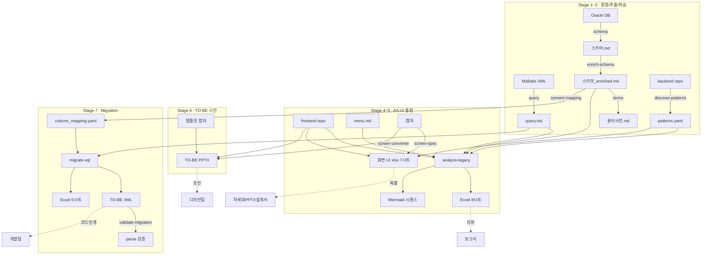

# 차세대 SI 분석·설계 자동화 도구 도입 기획서

> 발행일: 2026-05-13
> 대상: 본부장 / PM
> 작성: AS-IS → TO-BE 분석/설계 자동화 PoC 결과 종합
> 산출 코드베이스: `github.com/mose09/convert` (24 커맨드, Python CLI)

---

## 0. 한 줄 요약

차세대 SI **폐쇄망** 환경에서 Oracle 레거시 + React/Polymer 프론트 + MyBatis 쿼리 + 화면 캡처를 입력으로, **AST 패턴 기반 결정론적 추출 + 사내 LLM 게이트웨이 보조** 로 현행 분석·차세대 설계 산출물 (Markdown / Excel / Mermaid ERD / PPTX) 을 자동 생성하는 단일 CLI 도구.

---

## 1. 배경 및 필요성

### 1.1 차세대 SI 환경의 구조적 제약

| 제약 | 내용 | 영향 |
|------|------|------|
| **폐쇄망** | 외부 LLM (Claude/GPT/Gemini) / SaaS / GitHub Copilot 접근 불가 | 일반 AI 도구 미사용, 사내 LLM 게이트웨이 (vLLM / Ollama / 사내 게이트웨이) 만 허용 |
| **Oracle 11g 레거시** | FK / column comment 부재, thick mode 강제 (Instant Client) | 스키마만 봐서는 관계 파악 불가 — 쿼리/소스 통합 분석 필수 |
| **DRM 잠금** | 디자인 표준 PPTX 템플릿 파일 자체를 열 수 없음 | 템플릿 파싱 불가 → 화면 캡처 이미지로 우회 필요 |
| **Windows PC** | `pip` 직접 실행 제한, 폐쇄망 wheel 기반 install | `python -m pip download → 폐쇄망 install` 절차 필수 |
| **데이터 단방향** | 결과 산출물은 PC 로 download 가능, 화면/터미널 출력은 외부 반출 불가 | 진단 도구는 **결론 1~2줄** 만 emit, 상세는 파일 산출물로 |

### 1.2 기존 분석/설계 방식의 한계

- **수기 작성**: 화면 정의서 1장당 평균 3~4시간 (설계자 인력 의존). 휴먼 에러로 dataIndex / column comment 누락 빈번.
- **단편적 도구**: 스키마 추출은 SQL Developer, 쿼리 분석은 별도 BizTree, 화면 정의서는 Excel 수기, ERD 는 ERwin — **산출물 불일치 + 동기화 부재**.
- **LLM 직접 호출의 한계 (이번 PoC 에서 실증)**: 같은 화면 캡처를 같은 모델에 두 번 던져도 **검색 조건 라벨 / 그리드 컬럼 / 이벤트 플로우가 매번 다름**. temperature=0 으로도 토큰 샘플링 변동을 완전 제거 못함. → 설계서 산출물로 신뢰 불가.

### 1.3 본 도구의 포지셔닝

> 사내 LLM 게이트웨이를 활용하되, **변동성이 큰 영역 (자연어 narrative, 비즈니스 로직 해석) 만 LLM** 에 맡기고, **구조적으로 추출 가능한 영역 (필드/컬럼/이벤트/검증) 은 AST 패턴으로 결정론적 추출**. 같은 입력 → 같은 산출물을 보장하는 검증 가능한 자동화.

---

## 2. 솔루션 개요

### 2.1 단일 CLI 통합 도구 — 24 커맨드 (영역별)

```
$ python main.py <command> [options]
```

| 영역 | 커맨드 | 산출물 | LLM | Oracle |
|------|--------|--------|:---:|:---:|
| **스키마** | `schema` / `enrich-schema` | 스키마 .md (코멘트 LLM 보강) | 선택 | O |
| **쿼리** | `query` / `review-sql` | MyBatis JOIN/Table Usage .md | 선택 | X |
| **ERD** | `erd` / `erd-md` / `erd-group` / `erd-rag` | Mermaid + 인터랙티브 HTML ERD | 선택 | 선택 |
| **표준화** | `terms` / `morpheme` / `standardize` / `audit-standards` / `validate-naming` | 용어사전 / 형태소 / 위반 리포트 | 선택 | 선택 |
| **DDL** | `gen-ddl` | 자연어 → 표준 CREATE TABLE | O | 선택 |
| **레거시 분석** | `analyze-legacy` / `discover-patterns` / `convert-menu` | AS-IS 통합 리포트 (Excel 8시트, Mermaid 시퀀스) | 선택 | 선택 |
| **SQL Migration** | `convert-mapping` / `migration-impact` / `migrate-sql` / `validate-migration` | column_mapping.yaml / XML 일괄 변환 / parse 검증 | 선택 | O |
| **화면** | `screen-converter` / `screen-spec` | TO-BE PPTX 시안 (Vision LLM) / 화면 UI 정의서 xlsx (AST 결정론적) | 선택 | X |

### 2.2 설계 핵심 원칙 4가지

1. **폐쇄망 친화적** — `.env` 의 `LLM_API_BASE` / `LLM_API_KEY` / `LLM_MODEL` 만 갈아끼우면 동작. tree-sitter / Pillow / openpyxl 등 의존성은 폐쇄망 wheel 가이드 동봉.
2. **결정론적 우선** — 추출 가능한 데이터는 AST/regex 패턴. LLM 은 옵트인 (`--extract-biz-logic`, `--narrative` 등) 으로만.
3. **사내 컨벤션 흡수** — `patterns.yaml` 슬롯 + `discover-patterns` 가 사내 컴포넌트명 (`<MyForm>`, `<PrimaryButton>`, `postAxios`, `getBackendUrl` 등) 자동 학습.
4. **산출물 일관성** — `output/<영역>/<YYYYMMDD>/<파일>` 표준 경로, 시각 stamp 로 파일 충돌 방지, 동일 입력 byte-level 동일.

---

## 3. AS-IS 분석 산출물 (현행 분석자료)

| 계층 | 산출물 | 도구 | 비고 |
|------|--------|------|------|
| **DB** | 테이블/컬럼/PK/FK/Index .md | `schema` | Oracle thick mode, 11g 호환 |
| **DB (보강)** | 빈 코멘트 LLM 한글 보강 .md | `enrich-schema` | "LLM추천" 표기로 검수 표시 |
| **쿼리** | MyBatis/iBatis XML JOIN + Table Usage .md | `query` | XML dialect 자동 흡수 |
| **표준화** | 위반/표준 8섹션 리포트 | `standardize` | 약어/네이밍/도메인 검증 |
| **용어** | 약어 → 영문/한글/정의 사전 | `terms` | 스키마 + React 변수명 통합 수집 |
| **레거시 통합** | Controller→Service→XML→Table→RFC 체인 + biz logic LLM 추출 Excel 8시트 + Mermaid 시퀀스 | `analyze-legacy` | 화면 단위 closure 번들 + URL 매칭 + alt/else/loop 블록 자동 |
| **메뉴** | DB/Excel/MD 메뉴 → 표준 menu.md | `convert-menu` | 임의 양식 LLM 흡수 |
| **화면 UI 정의서** | 검색/그리드(물리명)/탭/이벤트+flow/검증 xlsx 7시트 | `screen-spec` | **AST 패턴, LLM 0, 같은 소스 → 같은 결과** |

### 3.1 강조: AST 기반 화면 UI 정의서 자동화 (이번 PoC 핵심)

`screen-spec` 은 React closure (entry + import BFS 자식들) 를 한 화면 단위로 보고, 다음을 코드 변동 없이 결정론적으로 추출:

- **검색 필드**: JSX `<input>` / `<Select>` / `<DatePicker>` 의 label / name / type / required / minLength / pattern props
- **그리드 컬럼**: `<Table columns={...}/>` array (const reference 자동 해석) → header / **dataIndex (물리명)** / type / width / hidden / sortable
- **탭**: `<Tab>` / `<TabPanel>`
- **이벤트 + 플로우**: `<Button onClick={fn}>` → fn 본체 AST traversal → `axios.post('/api/...')` / `navigate('/...')` / `window.open('...')` 순서 step list
- **검증**: 인라인 props + yup/zod/joi schema chain (`.required('msg').matches(/.../, 'msg2')`)

출력: 마스터 xlsx 1개 + 시트 = 영역 (개요/검색조건/그리드컬럼/탭/이벤트/검증규칙/이벤트플로우). PPTX 설계서에 시트 단위 복사·붙여넣기 워크플로우.

---

## 4. TO-BE 설계 산출물 (차세대 설계자료)

### 4.1 스키마 마이그레이션 파이프라인

```
[자연어 요구] ──gen-ddl──> [표준 DDL]
[AS-IS .md] + [TO-BE .md] ──convert-mapping──> [column_mapping.yaml]
[mapping] + [AS-IS XML] ──migration-impact──> [영향분석 리포트]
[mapping] + [AS-IS XML] ──migrate-sql──> [TO-BE XML + Excel 5시트]
[TO-BE XML] + [TO-BE Oracle] ──validate-migration──> [parse-only 검증]
```

각 단계 산출물이 다음 단계 입력으로 chain → **수기 전달 단계 0**.

### 4.2 화면 설계 산출물

| 산출물 | 도구 | 방식 |
|--------|------|------|
| **화면 UI 정의서 xlsx** | `screen-spec` | AST 패턴 (결정론적). 차세대 화면 컴포넌트 정의서로 그대로 활용 |
| **TO-BE 화면 시안 PPTX** | `screen-converter` | Vision LLM (PoC). 템플릿 캡처 → style profile 추출 → AS-IS + closure 소스 → 도형 슬라이드 |

### 4.3 차세대 환경에서의 산출물 활용

- **Excel 화면 정의서** → 사내 PPTX 표준 슬라이드에 **시트별 복사·붙여넣기** (예: 검색조건 시트 → 검색조건 슬라이드)
- **PPTX 시안** → 화면 설계 리뷰용 + 디자인팀 인계용 초안
- **Mermaid 시퀀스** → 비즈니스 로직 검증 회의 자료
- **column_mapping.yaml** → 마이그레이션 코드 자동 생성 입력
- **terms 사전** → 차세대 표준 용어집 / 디자인 시스템 라벨 정의

---

## 5. 신규 환경 산출 절차 (Step-by-Step)

### Stage 1. 환경 구축 (1회)

```powershell
# 폐쇄망 wheel 다운로드 (인터넷 PC)
python -m pip download -r requirements.txt -d .\wheels ^
  --platform win_amd64 --python-version 311 --only-binary=:all:

# 폐쇄망 PC 설치
python -m pip install --no-index --find-links=.\wheels -r requirements.txt

# .env 작성 (사내 LLM 게이트웨이)
ORACLE_USER=... / ORACLE_DSN=... / ORACLE_INSTANT_CLIENT_DIR=...
LLM_API_BASE=http://internal-llm-gateway/v1
LLM_MODEL=<vision 가능 모델 ID>
PATTERN_LLM_MODEL=<코딩 특화 모델 ID>
```

### Stage 2. 데이터 추출 (자동)

```powershell
python main.py schema                                  # Oracle 스키마 → .md
python main.py query \\path\to\mapper                  # MyBatis XML → .md
python main.py enrich-schema --schema-md ...           # 빈 코멘트 LLM 보강
python main.py terms --schema-md ... --react-dir ...   # 용어사전
```

### Stage 3. 패턴 학습 (1회, 프로젝트당)

```powershell
python main.py discover-patterns ^
  --backend-dir <one-project> ^
  --menu-md input\menu.md ^
  --frontends-root <front-root>
```
→ `patterns.yaml` 생성 (사내 framework, URL prefix, 컴포넌트 명, API wrapper 학습)

### Stage 4. AS-IS 통합 분석

```powershell
python main.py analyze-legacy ^
  --backends-root <back-root> ^
  --frontends-root <front-root> ^
  --menu-md input\menu.md ^
  --patterns output\legacy_analysis\patterns.yaml ^
  --menu-only --extract-biz-logic ^
  --sequence-diagram --sequence-diagram-frontend
```
→ AS-IS 통합 Excel 8시트 + Mermaid 시퀀스 / 비즈니스 로직 요약

### Stage 5. 화면 UI 정의서 (결정론적)

```powershell
python main.py screen-spec ^
  --captures-dir input\asis_captures ^
  --frontend-dir <front-root> ^
  --patterns output\legacy_analysis\patterns.yaml ^
  --source-mapping input\screen_source_mapping.yaml
```
→ `output\screen-spec\<YYYYMMDD>\screen_spec_<HHMMSS>.xlsx` (7시트, LLM 0)

### Stage 6. TO-BE 시안 PPTX (선택, Vision LLM)

```powershell
python main.py screen-converter ^
  --captures-dir input\asis_captures ^
  --templates-dir input\template_captures ^
  --frontend-dir <front-root>
```
→ TO-BE 시안 PPTX + style_profile.json + llm_raw 디버그 dump

### Stage 7. SQL Migration (TO-BE 스키마 확정 후)

```powershell
python main.py convert-mapping --mapping-md asis-tobe-mapping.md
python main.py migration-impact --mapping ... --mybatis-dir ...
python main.py migrate-sql --mapping ... --to-be-schema ... --mybatis-dir ...
python main.py validate-migration --xml-dir ... --to-be-dsn ...
```
→ TO-BE 변환 XML + Excel 영향분석 + parse 검증 결과

### Stage 산출물 흐름도



---

## 6. 기술 차별점

### 6.1 AST 기반 결정론적 추출

- **tree-sitter** 기반 JSX/TSX/JS/TS 파싱 → regex 한계 회피
- 화면 단위 = **closure** (entry + import BFS, node_modules 차단). `<SearchPanel/>` / `<OrderGrid/>` / `<Buttons/>` 가 분리돼 있어도 자동 통합
- **5종 추출기** + **flow tracer**: 검색 필드 / 그리드 컬럼 / 탭 / 이벤트+플로우 / 검증
- **검증**: 3회 연속 실행 → JSON byte-identical 보장 (sandbox 테스트 완료)

### 6.2 LLM 사용 최소화 + 옵트인 분리

| 영역 | 추출 | LLM 사용 여부 |
|------|------|---------------|
| 화면 필드/컬럼/버튼/검증 | AST | **0** |
| 화면 이벤트 플로우 (step list) | AST | **0** |
| 비즈니스 로직 narrative | analyze-legacy LLM | `--extract-biz-logic` opt-in |
| 스키마 컬럼 코멘트 보강 | LLM | enrich-schema 본연 |
| TO-BE PPTX 시안 | Vision LLM | screen-converter (PoC) |
| 자연어 설계서 narrative | (선택) LLM | `--narrative` 후속 |

### 6.3 closure 번들링 — 화면 = 자체 작성 코드 한 덩어리

```python
ScreenClosure
├── entry: src/pages/order/OrderListPage.tsx (depth=0, full)
├── child:  SearchPanel.tsx                  (depth=1, full)
├── child:  OrderTable.tsx                   (depth=1, full)
└── child:  Buttons.tsx                      (depth=1, full)
   + api_calls: [POST /api/orders/search, ...]  (factual)
   + popup_refs: [...]                          (factual)
```

- `max_depth=3`, `token_budget=20000` 안에서 자동 mode 강등 (full → signature → meta)
- 사내 path alias (tsconfig `paths`) 자동 해석
- `node_modules` 자동 제외

### 6.4 patterns.yaml 으로 사내 컨벤션 흡수

```yaml
# discover-patterns 가 자동으로 채우거나 사용자가 수기 보강
react:
  api_call:
    wrappers: ["postAxios", "apiClient", "http"]
    methods:  ["get", "post", "put", "delete"]
  screen_spec:
    input_components: ["MyInput", "MyDate"]
    table_components: ["MyDataTable"]
    button_components: ["MyButton", "PrimaryButton"]
  url:
    react_route_prefix: "/app"
    menu_url_scheme: "app_prefixed"
```

→ 사내 component 명 / wrapper 함수 / URL prefix 가 달라도 코드 수정 없이 적응.

### 6.5 산출물 워크플로우 친화 (PPTX 복붙 / Excel 시트)

- 마스터 xlsx 시트 = 영역 (개요 / 검색조건 / 그리드컬럼 / 탭 / 이벤트 / 검증규칙 / 이벤트플로우)
- 1열 공통 = 화면명 (정렬/필터로 화면별 추출)
- freeze panes + 한글 폰트 (맑은 고딕) + header 스타일
- PPTX 슬라이드에 표 단위 Ctrl+C → Ctrl+V 로 변환 가능 (실 운영 워크플로우와 일치)

---

## 7. 도입 효과

### 7.1 정량적

| 지표 | 수기 | 본 도구 | 개선 |
|------|-----|---------|------|
| 화면 정의서 1장 작성 | 3~4 시간 | 1분 (CLI 실행) | **~200배 단축** |
| 100 화면 전수 분석 | 약 400 인시 | 1~2 인시 | **~200배 단축** |
| 동일 입력 재실행 시 산출물 일관성 | 사람마다 다름 | 100% (byte-level identical, AST 영역) | - |
| SQL Migration 영향분석 | 수일 | 분 단위 | - |
| 시퀀스 다이어그램 작성 | 화면당 30~60분 | 자동 (analyze-legacy) | - |

### 7.2 정성적

- **신뢰성**: AST 영역은 검수 부담 없음 (소스 변경 없으면 산출물 동일)
- **유지보수**: 소스 변경 시 재실행 → 산출물 즉시 갱신 (수기 동기화 불요)
- **인력 의존도 감소**: 시니어 분석가의 도메인 지식이 patterns.yaml 로 자산화
- **표준화**: 동일 도구로 모든 화면/모든 프로젝트 → 산출물 양식 통일

### 7.3 차세대 산출물 활용 매트릭스

| 산출물 | 활용처 | 활용 방식 |
|--------|--------|-----------|
| 스키마 .md | 차세대 DB 설계 | TO-BE 스키마 작성 기초 자료 |
| 용어사전 | 차세대 표준 용어집 / 디자인 라벨 | 그대로 / 가공 |
| 화면 UI xlsx | **차세대 화면 설계서 PPTX** | 시트 단위 복붙 |
| Excel AS-IS 8시트 | **차세대 화면 영향분석** | 매핑표 / 리뷰 자료 |
| Mermaid 시퀀스 | 차세대 비즈니스 로직 검증 | 회의/검토 자료 |
| column_mapping.yaml | **차세대 마이그레이션 코드** | migrate-sql 자동 변환 |
| TO-BE PPTX 시안 | 디자인팀 인계 | 화면 와이어프레임 초안 |
| TO-BE XML | **개발팀 인계** | 그대로 사용 또는 보정 |

---

## 8. 제품화 / 도입 로드맵

### Phase 1 — PoC 검증 (현재 완료)
- 24 커맨드 단일 CLI
- 합성 fixture e2e 테스트 통과
- 단일 프로젝트 실 데이터 검증 (사용자 PC 진행 중)
- 산출물: 본 기획서 + 코드베이스

### Phase 2 — 사내 표준화 (3~6 개월)
- **CI 통합**: 매일 자동 실행 → 산출물 wiki/SharePoint 발행
- **사내 LLM 게이트웨이 표준 모델 픽서**: 분기별 모델 업데이트 추적
- **패턴 카탈로그**: 프로젝트별 patterns.yaml 사내 공유 저장소
- **GUI 또는 웹 인터페이스 옵션**: 분석가가 명령 조립 없이 클릭으로
- **교육**: 분석가 대상 8h 워크숍 (CLI + 결과 해석 + patterns.yaml 보강)

### Phase 3 — 제품화 / 사내 SaaS (6~12 개월)
- 사내 Docker 배포 + 멀티 프로젝트 동시 분석
- 결과 산출물 버전 관리 (어떤 시점의 소스로 만들어졌는지 추적)
- 차세대 PPTX 표준 슬라이드 템플릿과 직접 통합 (xlsx → pptx auto-paste)
- ANALYTICS 대시보드: 100 화면 중 N장 자동 완성 / M장 매칭 실패 등
- 동일 분석 엔진의 **타 RDBMS (MariaDB, PostgreSQL)** 확장

---

## 9. 리스크 및 대응

| 리스크 | 영향 | 대응 |
|--------|------|------|
| **tree-sitter 의존성** | screen-spec / analyze-legacy closure 미동작 | 폐쇄망 wheel install 가이드 + 자동 fallback (단일 파일 모드) |
| **사내 dialect 미수용** | 사내 컴포넌트명 / wrapper 미인식 → 추출 누락 | `patterns.yaml` 슬롯 + `discover-patterns` LLM 자동 발견 |
| **LLM 게이트웨이 품질 변동** | enrich-schema / biz-logic / vision PoC 품질 변동 | (1) AST 결정론 영역은 무영향. (2) LLM 영역은 raw dump + `--no-llm` fallback. (3) 모델 분기별 회귀 테스트 |
| **DRM 잠긴 템플릿** | screen-converter 의 style profile 추출 한계 | 캡처 이미지 우회 + 사용자 hex `--style-overrides` 후속 옵션 |
| **한글 캡처명 vs 영문 컴포넌트명 매칭 실패** | screen-spec / converter 자동 매칭 누락 | `--source-mapping yaml` 수기 보완 + 휴리스틱 임계 4 완화 |
| **동적 변수 binding 100% 해석 불가** | 조건부 컬럼 (`isAdmin ? A : B`) 누락 | 보수적 양 분기 추출 (후속 작업) |
| **사용자 폐쇄망 PC 의 단방향 채널** | 디버깅 시 출력 반출 제한 | 진단 도구는 1~2줄 결론 emit + 산출물 dir 에 raw json 저장 |

---

## 10. 소요 자원 (Phase 2 가정)

| 항목 | 내용 | 비고 |
|------|------|------|
| **인력** | Python 개발 0.5 FTE × 6개월 | 도구 유지보수 + CI 통합 + 패턴 추가 |
| **인프라** | 사내 LLM 게이트웨이 (기존 활용) | 코딩 모델 + Vision 모델 각 1 인스턴스 권장 |
| **저장소** | 산출물용 wiki / SharePoint / 사내 GitLab | 기존 인프라 활용 가능 |
| **교육** | 8h 워크숍 × 2~3회 | 분석가 / 설계자 대상 |

---

## 11. 결론 및 요청 사항

본 PoC 는 **차세대 SI 폐쇄망 환경에서 LLM 변동성을 우회한 결정론적 분석/설계 자동화**가 가능함을 실증했습니다. 24 커맨드 단일 CLI 로 AS-IS 추출부터 TO-BE 시안까지 chain 으로 연결되며, 핵심 산출물 (화면 UI 정의서, 마이그레이션 변환 XML, 표준 ERD/용어집) 은 사람이 동일 결과로 재현 가능합니다.

**요청 사항**:
1. Phase 2 진행 승인 (사내 표준화 + CI 통합 + 패턴 카탈로그)
2. 사내 LLM 게이트웨이 표준 모델 픽스 (Vision 모델 1종 + 코딩 모델 1종)
3. 1 개 차세대 SI 사업에 베타 적용 (실 검증 + 사용자 피드백 반복)
4. 본 도구의 사내 표준 산출물로 지정 검토

---

## 부록 A. 24 커맨드 전수 목록 (Quick Reference)

| 커맨드 | 목적 | LLM | Oracle |
|--------|------|:---:|:---:|
| `schema` | 테이블/컬럼/PK/FK/Index → Markdown | X | O |
| `query` | MyBatis/iBatis XML → JOIN 관계 + Table Usage | X | X |
| `enrich-schema` | 빈 코멘트에 LLM 한글 설명 | O | X |
| `erd` / `erd-md` / `erd-group` / `erd-rag` | Mermaid + 인터랙티브 HTML ERD | 선택 | X |
| `terms` | 스키마 + React 소스에서 용어사전 | O | X |
| `morpheme` | 속성명 형태소분석 | O | X |
| `standardize` | 표준화 리포트 (8섹션) | 선택 | 선택 |
| `review-sql` | SQL 안티패턴 + LLM 개선안 | 선택 | X |
| `validate-naming` | DDL/이름 표준 준수 검증 | X | X |
| `gen-ddl` | 자연어 → 표준 CREATE TABLE | O | 선택 |
| `audit-standards` | 기존 스키마 전수 감사 | X | X |
| `analyze-legacy` | AS-IS 소스 분석 핵심 — Controller→Service→XML→Table→RFC + biz logic LLM | 선택 | 선택 |
| `discover-patterns` | LLM 프로젝트 구조 자동 추출 → patterns.yaml | O | X |
| `convert-menu` | 임의 양식 메뉴 Excel → 표준 menu.md | O | X |
| `convert-mapping` | AS-IS↔TO-BE .md → column_mapping.yaml | 선택 | X |
| `migration-impact` | SQL Migration 사전 영향분석 | X | X |
| `migrate-sql` | MyBatis XML 일괄 변환 + 5시트 리포트 | 선택 | X |
| `validate-migration` | 변환 XML parse-only 검증 (Stage B) | X | O |
| `screen-converter` | AS-IS 캡처 → TO-BE PPTX (Vision LLM, PoC) | O | X |
| `screen-spec` | React 화면 closure → 화면 UI 정의서 xlsx 7시트 (AST, **LLM 0, deterministic**) | X | X |

## 부록 B. 산출물 폴더 구조

```
output/
├── schema/<YYYYMMDD>/
├── query/<YYYYMMDD>/
├── enrich-schema/<YYYYMMDD>/
├── erd/<YYYYMMDD>/
├── terms/<YYYYMMDD>/
├── morpheme/<YYYYMMDD>/
├── standardize/<YYYYMMDD>/
├── sql_review/<YYYYMMDD>/
├── naming_validation/<YYYYMMDD>/
├── ddl/<YYYYMMDD>/
├── audit/<YYYYMMDD>/
├── legacy_analysis/<YYYYMMDD>/
│   ├── ... (analyze-legacy + discover-patterns + raw LLM 덤프)
│   └── .biz_cache/   ← 영구 캐시 (일자 폴더 밖)
├── migration/<YYYYMMDD>/
├── screen-converter/<YYYYMMDD>/
│   ├── screens_<HHMMSS>.pptx
│   ├── style_profile.json
│   └── llm_raw/<화면>.json
└── screen-spec/<YYYYMMDD>/
    └── screen_spec_<HHMMSS>.xlsx
```

## 부록 C. 의존성 / 설치 (폐쇄망)

```bash
# requirements.txt 핵심
oracledb         # Oracle thick mode
openai           # LLM 호환 SDK (사내 게이트웨이도 OpenAI API 규약이면 동일 사용)
python-pptx      # PPTX 도형 렌더 (screen-converter)
openpyxl         # xlsx writer (screen-spec, analyze-legacy 등)
Pillow           # 이미지 처리 (style profile aspect 감지)
chromadb         # 벡터 DB (erd-rag)
pyyaml / lxml / sqlglot / xlsxwriter
tree-sitter / tree-sitter-javascript / tree-sitter-typescript  # JSX AST
```

폐쇄망 wheel 절차:
```powershell
# 인터넷 PC
python -m pip download -r requirements.txt -d .\wheels ^
  --platform win_amd64 --python-version 311 --only-binary=:all:

# 폐쇄망 PC (wheels 폴더 옮긴 후)
python -m pip install --no-index --find-links=.\wheels -r requirements.txt
```

## 부록 D. 본 PoC 개발 일지 요약 (이번 세션, 화면변환 → screen-spec 진화)

| PR # | 변경 | 학습 / 통찰 |
|------|------|------------|
| 180  | screen-converter PoC (Vision LLM) | VLM 으로 캡처 + 템플릿 → layout JSON + PPTX 도형 |
| 181  | SCREEN_LLM_MODEL 미사용 키 정리 | 환경변수 일관성 |
| 182  | llm_raw 디버그 dump | VLM 출력 사후 검증 가능 |
| 183  | 프롬프트 row-major 순서 | 검색 필드가 위→아래 column-major 로 나오던 문제 |
| 184  | 위치 추출 bbox 추가 | VLM 이 regions {x,y,w,h} 도 반환하도록 |
| 185  | --frontend-dir 옵션 | 캡처에 매칭되는 React 소스 첨부 (휴리스틱) |
| 186  | 버튼 y 편향 + 폰트 + 진단 강화 | example bbox 가 그대로 베껴지는 LLM bias 발견 |
| 187  | 템플릿 style profile 추출 | 출력 PPTX 색·폰트가 템플릿과 일관되게 |
| 188  | 파일명 시각 stamp | PowerPoint 열린 채 재실행해도 충돌 없음 |
| 189  | closure 번들링 통합 | `legacy_react_closure` 재사용 — entry + 자식 한 덩어리 |
| 198  | **screen-spec 신규 — AST 결정론적 추출** | **LLM 변동성 근본 해결, 같은 소스 → 같은 산출물** |

핵심 통찰: **"VLM 한 번 호출로 모든 추출 + 해석 + 서술화" 가 본질적으로 불가능**. 추출은 결정론적 도구로, LLM 은 자연어 다듬기 같은 변동 허용 영역만 — 이 분리가 신뢰 가능한 자동화의 전제.

---

*문의 / 시연 요청 / 차세대 사업 적용 검토: `github.com/mose09/convert` 또는 작성자에게 직접 연락.*
